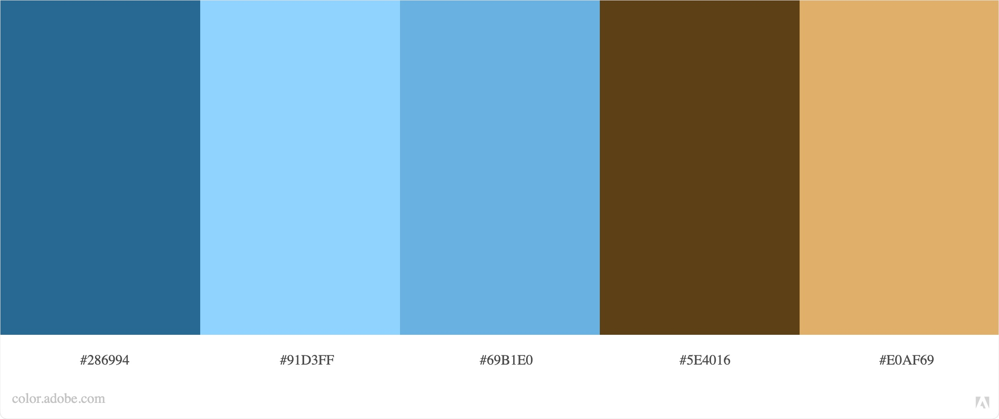

# Llewelyn Henshaw Art Website

An online portfolio and gallery to showcase and sell artwork by JL Henshaw. Where art and interior lovers can shop, find out more about the artist and enquire about commission pieces. It is designed to be accessible on a range of devices, so customers can browse at their convenience.

[//]: # (Add image here of finished website - on different screensizes if possible)

## User Experience
---

### _User Stories_

- #### First Time Visitor Goals:
1. As a first time user, I want to find out the purpose of the website immediatly.
2. As a first time user, I want to find clear navigation to all parts of the website.
3. As a first time user, I want to browse artwork made by the artist and find social links to keep track of new work.
4. As a first time user, I want to find out how to purchase art and how it will be shipped.

- #### Returning Visitor Goals:
1. As a returning customer, I want to find out more about the artist background.
2. As a returning customer, I want to find out how to get in touch for commission enquiries.

- #### Frequent User Goals:
1. As a frequent user, I want to find out if there are newly added artpieces.

### _Design_

- #### Colour Scheme

- #### Typography

