# Llewelyn Henshaw Art Website

An online portfolio and gallery to showcase and sell artwork by Llewelyn Henshaw. An online destination where art and interior lovers can shop, find out more about the artist and enquire about commission pieces. It is designed to be accessible on a range of devices, so customers can browse at their convenience. 

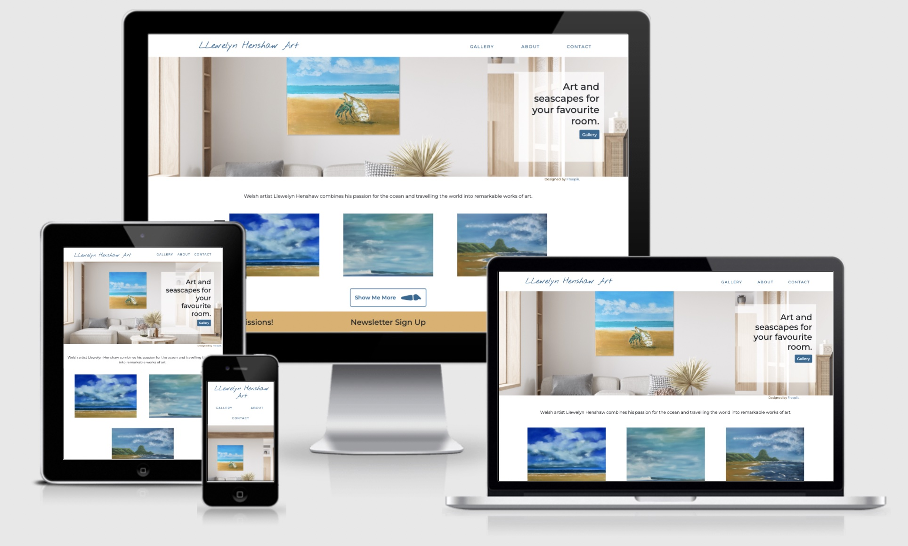 

## User Experience
---

### _User Stories_

- #### **First Time Visitor Goals:**
1. As a first time user, I want to find out the purpose of the website immediately.
2. As a first time user, I want to find clear navigation to all parts of the website.
3. As a first time user, I want to browse artwork made by the artist and find social links to keep track of new work.

- #### **Returning Visitor Goals:**
1. As a returning user, I want to find out more about the artist background.
2. As a returning user, I want to find out how to get in touch for commission enquiries.
3. As a returning user, I want to find out how to purchase art and how it will be shipped.

- #### **Frequent User Goals:**
1. As a frequent user, I want to find out if there are newly added artpieces.

### _Design_

- #### **Colour Scheme**

    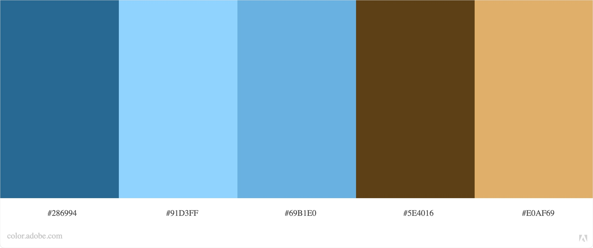 
    Colour scheme accessible to color blind users. Made with [Adobe Color](https://color.adobe.com/).

- #### **Typography**

    <strong>Logo:</strong> Nothing You Could Do (Google Fonts). This font resembles the artist's signature. 
    <strong>Main font:</strong> Montserrat. Clear, legible without being too formal looking.

- #### **Wireframes**

     

    Wireframes for index, gallery, about & contact page.
    Made with [Balsamiq](https://balsamiq.com/).

    During the developing process a few changes were made to the lay-out to improve user experience.

## Features
---

### _Existing Features_

- __Navigation Bar__

    Includes a click-able 'logo' and links to all other pages on the website: gallery, about & contact.
    Navigation bar remains the same on every page on the website to navigate easily back and forth between pages without the need of the browser's own buttons.
    'Home' link was provided but flagged up in accessability testing as redundant link due to the clickable logo, so it was removed from nav bar.

    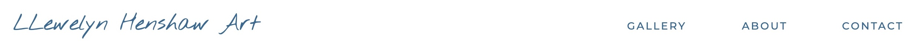 

- __Landing Page Image__

    With the landing page image and text, the user instantly knows what the website is about. It also offers an interior example of the artwork made by Llewelyn Henshaw, which is available on the website. They can see how the art could look in the interior of their favourite room. The wall mock up was designed by [Freepik](https://www.freepik.com/).

    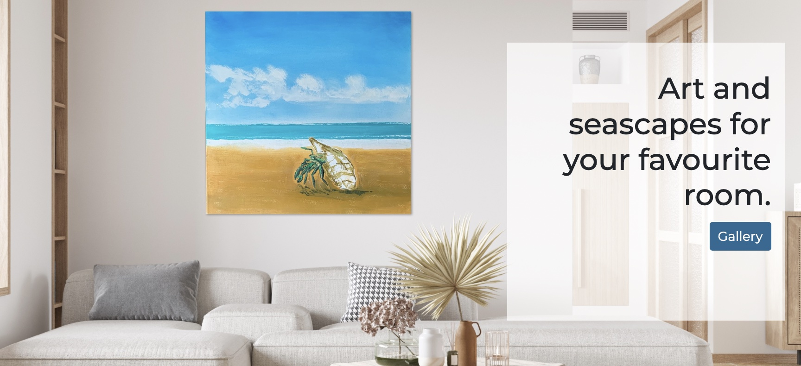 

- __Landing Page Gallery__

    A snippet about the artist and a 'sneak peek' of more art pieces available in the gallery.
    There is a 'call to action' button that takes users directly to the gallery.

    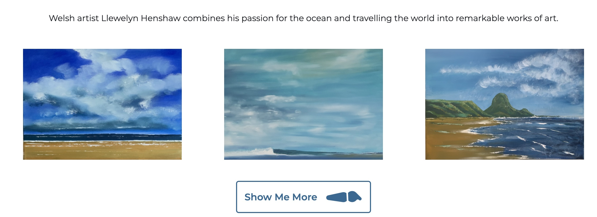 

- __Footer__

    - *Info:* includes a 'catchy title' so users know about commission pieces and quick links to more info on contact and shipping page. Also includes credits to [Freepik](https://www.freepik.com/) which was used for the hero image.
    - *Newsletter Sign up:* straightforward for users to sign up to the newsletter to keep up to date with new artwork and news from the artist.
    - *Social:* users can find and follow social profiles of the artist with a clear overview of social channels available.

    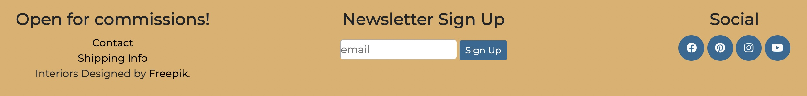 

- __Gallery__

    - *Slideshow Section:* gives users examples of how the artwork could look in different interiors. 

    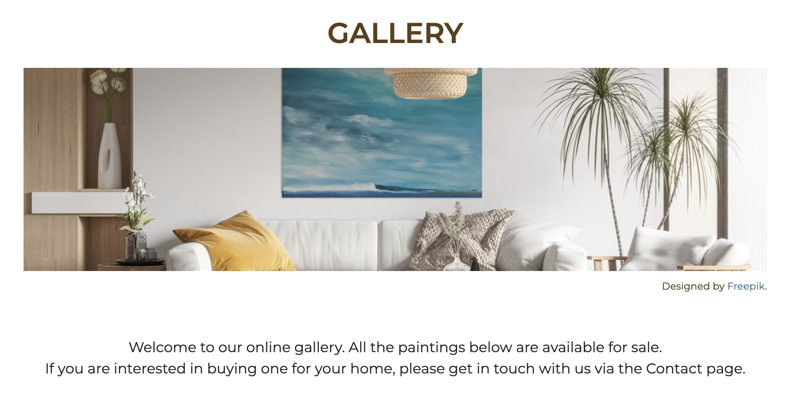 

    - *Gallery:* overview of finished artpieces with prices.

    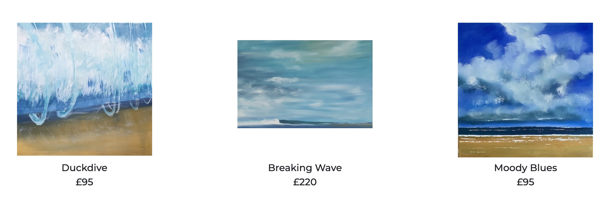 

- __About__

    - *About The Artist:* users can find a short background story on Llewelyn Henshaw.

    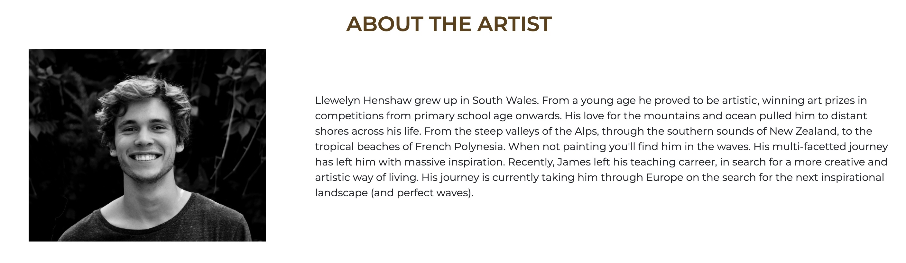 

    - *Art Galleries:* users can find out where the artists artwork is available and displayed.

    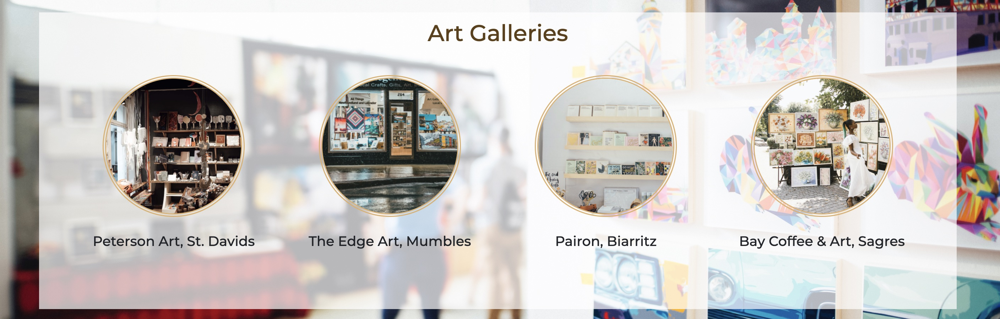 

    - *Markets:* users are informed of future art markets where they can meet and discuss in person with the artist.

    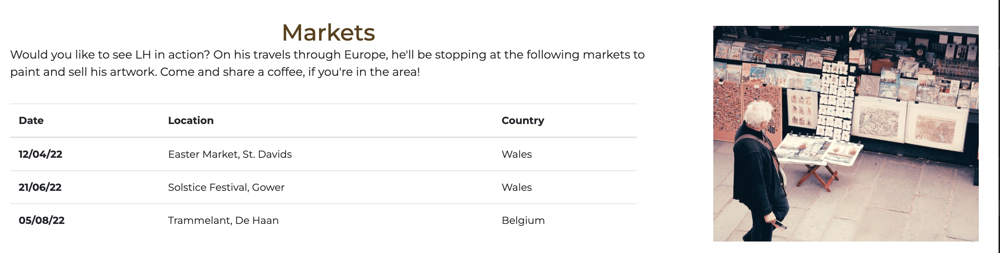 

- __Contact__

    Users are invited to get in touch regarding the buying process or commission enquiries.

    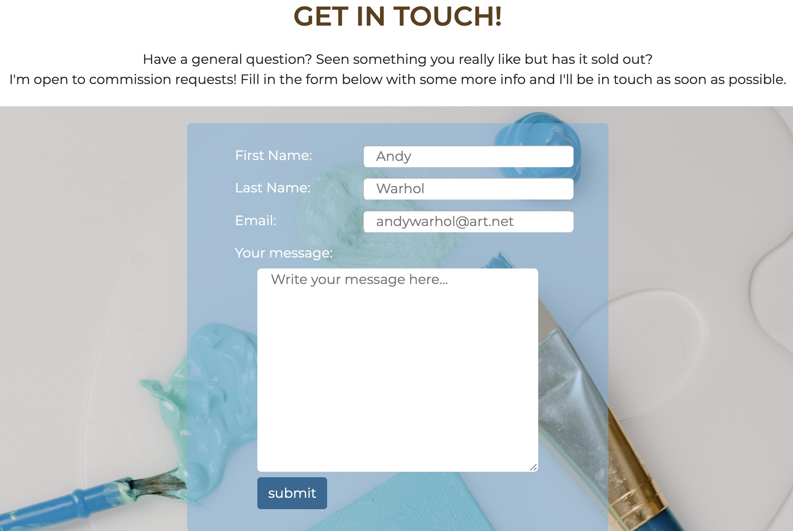 

### _Features Left To Implement_

- __Shipping Info__

    Page with shipping Info for the purchase of art work.
    Currently there is placeholder text with a call to sign up, 
    so the user can be notified once more info is available.

    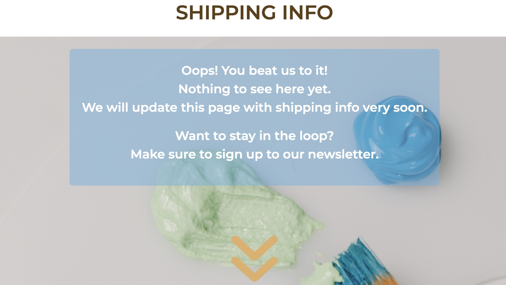 

- __Art Measurements__

    Add measurements by price on gallery page.

## Technologies Used
---

### _Languages Used_

-   [HTML5](https://en.wikipedia.org/wiki/HTML5)
-   [CSS3](https://en.wikipedia.org/wiki/Cascading_Style_Sheets)

### _Frameworks, Libraries & Programs Used_

1. [Bootstrap:](https://getbootstrap.com/docs/5.1/getting-started/introduction/)
    - Bootstrap was used on parts of the website to make them responsive.
1. [Fontawesome:](https://fontawesome.com/v6)
    - Icons and Fontawesome inline styling.
1. [Photoshop:](https://www.adobe.com/ie/products/photoshop.html)
    - Photoshop was used to edit the interior photos for the website.
1. [Adobe Color:](https://color.adobe.com/)
    - Adobe Color was used to select the colour scheme and test its accessibility.
1. [Balsamiq:](https://balsamiq.com/)
    - Balsamiq was used to create the wireframes during the design process.
1. [Gitpod:](https://gitpod.io/workspaces)
    - Gitpod workspaces was used to create and edit code and push them onto the Github repo.
1. [GitHub:](https://github.com/)
    - GitHub is used to store the projects code after being pushed from the Gitpod.
1. [Hover.css:](https://ianlunn.github.io/Hover/)
    - Hover.css was used on the Social Media icons in the footer to add the float transition while being hovered over.
1. [Google Fonts:](https://fonts.google.com/)
    - Google fonts was used to import the 'Montserrat' and 'Nothing You Could Do' (logo) fonts into the style.css file which are used on all pages.

## Testing 
---

- [HTML](https://jigsaw.w3.org/css-validator/#validate_by_input)
- [CSS](https://jigsaw.w3.org/css-validator/validator)

### _Validator Testing_

- #### **HTML**

    - Error: button must not appear as descendent of a tag. -> Fixed by adding the btn classes to the a tag and deleting the button tag.
    - Error: no h1, h2, ... inside sections. -> Fixed by changing to semantic HTML tags article and div where appropriate.
    - Error: width="270px" in HTML, no need for px. -> Fixed.
    - Error: form action="" blank. -> deleted.

- #### **CSS**

    - Error: background-position top and 100px are incompatible -> fixed by deleting 100px

### _WAVE Web Accessibility Evaluation Tool_

- 'Home' link removed from menu as it was flagged as redundant because the logo is a link to index.html.
- Correct use of h1, h2, h3, ... headings.
- Fixed contrast issue on hover over links in footer.

### _Unfixed Bugs_

- 1 alert using WAVE accessability tool was a redundant link in footer to the contact page, however this link goes together with a call to action for commission pieces so I decided to keep it in the footer for the ease of users wanting to get in touch.

### _Testing User Stories from User Experience (UX) Section_

- #### **First Time Visitor Goals:**
1. As a first time user, I want to find out the purpose of the website immediately.
    - The logo, hero image and text state clearly this website is about art by LLewelyn Henshaw.
2. As a first time user, I want to find clear navigation to all parts of the website.
    - The navigation is clear and immediately visible on top of the page, there is no distraction by background.
3. As a first time user, I want to browse artwork made by the artist and find social links to keep track of new work.
    - There are several ways to get to the gallery page from the index page or via the main menu from all other pages.

- #### **Returning Visitor Goals:**
1. As a returning user, I want to find out more about the artist background.
    - Users can find out more about the artist by navigating to the 'About' page in the main menu.
2. As a returning user, I want to find out how to get in touch for commission enquiries.
    - There is a clear call to action in the footer and on the gallery page above the artwork.
3. As a returning user, I want to find out how to purchase art and how it will be shipped.
    - On the gallery page users are invited to get in touch if they want to purchase art, the shipping info can be found via a link in the footer. This page is 'under construction' but users are invited to sign up to the newsletter so they can be informed as soon as there is more information available.

- #### **Frequent User Goals:**
1. As a frequent user, I want to find out if there are newly added artpieces.
    - NEW badges are added to new artpieces. Users can also sign up to the newsletter in the footer to be kept updated with all the news.

## Deployment
---
This project was developed on Gitpod, committed to Git and pushed onto the [Github repository](https://github.com/StienBoodts/CI-Portfolio-Project1) using Bash. 

To deploy the website from the repository onto Github Pages the following steps were taken:

1. log into Github
2. from the list of repositories, choose **StienBoodts/CI-Portfolio-Project1**.
3. Navigate to **Settings** at the top of the repository.
4. Choose **Pages** from the menu on the left of the page.
5. In the Source Section, select **Branch: main** in the drop down menu.
6. Leave **/(root)** selected in the next drop down menu.
7. Press **Save**
8. The page will refresh and the **link to the deployed website** will appear at the top.

## Credits & Resources
---

### _Content_ 

1. [Code Institute](https://codeinstitute.net/)
    - general info and practice of HTML, CSS & UX lessons and mini projects taken as reference for the creation of this website.
1. [CSS-tricks](https://css-tricks.com/)
    - additional general info and problem solving on HTML and CSS coding
1. [https://stackoverflow.com/](https://stackoverflow.com/)
    - solve overlapping divs
1. [MDN Web Docs](https://developer.mozilla.org/en-US/docs/Web/HTML/Element)
    - HTML5 Elements Reference
1. [MDN Web Docs](https://developer.mozilla.org/en-US/docs/Web/CSS/transform-function/rotate())
    - CSS rotate of Fontawesome icon
1. [MDN Web Docs](https://developer.mozilla.org/en-US/docs/Web/CSS/Layout_cookbook/Sticky_footers)
    - Sticky footers on bigger screens
1. [W3C](https://www.w3.org/Style/Examples/007/slideshow.en.html)
    - slideshow using CSS keyframes in gallery.html
1. [Github Docs](https://docs.github.com/en/get-started/writing-on-github/getting-started-with-writing-and-formatting-on-github/basic-writing-and-formatting-syntax)
    - Github Markdown Cheat Sheet

### _Media_

1. [Freepik](https://www.freepik.com/)
    - Freepik was used to provide the 'mock up' interior walls for displaying artwork.
1. [Pexels](https://www.pexels.com/search/gallery/)
    - Pexels was used for images on about.html and background image on shipping.html and contact.html
    - Credits: 
        - Artist portrait, about.html; Photo by Stefan Stefancik from Pexels.
        - Art Galleries, about.html; Background photo by Markus Spiske from Pexels, first photo by furkanfdemir from Pexels, second photo by Erik Mclean from Pexels, third photo by Rachel Claire from Pexels, last photo by Godisable Jacob from Pexels.
        - Market Photo, about.html: Photo by Gabriel Peter from Pexels.
        - Background photo on contact.html and shipping.html: Photo by Tara Winstead from Pexels.
